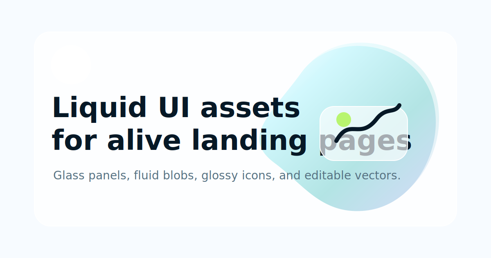

# Liquid UI - Modern SaaS Landing Page 🚀

Welcome to the **Liquid UI Landing Page** project! This is a fully responsive, visually stunning multi-page website template designed for modern AI and SaaS products.



## 🌟 Features

- **Immersive Video Background**: A seamless, auto-playing video background that captures attention immediately.
- **Glassmorphism Design**: Beautiful glass panels with translucent backgrounds, subtle borders, and soft shadows using modern CSS backdrop filters.
- **Fluid UI Components**: Polished buttons, responsive navigation, and well-structured layout blocks that adapt to any screen size.
- **Fully Responsive**: Optimized for desktop, tablet, and mobile viewing.
- **Multi-page Structure**: Includes ready-to-use pages for Features, How it Works, Pricing, Customers, and Contact.

## 📂 Project Structure

- `index.html` - The main landing page.
- `features.html`, `how-it-works.html`, `pricing.html`, `customers.html`, `contact.html` - Inner pages.
- `styles/main.css` - Core stylesheet containing the layout and typography.
- `styles/tokens.css` - CSS variables for colors, spacing, shadows, and fonts.
- `assets/` - Contains icons, illustrations, and SVG graphics (including the logo and social preview image).
- `video.mp4` - The background video used across the site.

## 🛠️ Getting Started

1. **Clone the repository**:
   ```bash
   git clone https://github.com/nivas4506/ui-ux-project1.git
   ```
2. **Open the project**:
   Simply open `index.html` in your favorite web browser to see the live project!

## 🎨 Design System

This project uses a carefully crafted set of design tokens to maintain a consistent look and feel. The core theme revolves around a dark, immersive tech vibe with bright blue accents. 

To customize the colors, simply edit the CSS variables in `styles/tokens.css`.

---
*Built with modern HTML5 & CSS3.*
